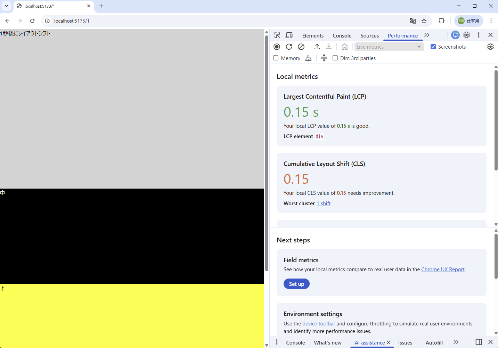

# Reactの実例で覚えるCLS

---

## CLSとは

web.devの解説がわかりやすいです
読みましょう
https://web.dev/articles/cls?hl=ja

CLSスコアは0.1を超えたらアウト！

---

## 動かしてみる

こちらにアクセス
https://onfi.github.io/react-cls/build/client/1/

ソース
https://github.com/onfi/react-cls/blob/main/app/routes/1.tsx

Divが3つあり、真ん中のDivがsetTimeoutで1秒後に表示する

---

## 手元で動かしてみたいとき

このリポジトリをcloneして、実行していみれます

```
git clone https://github.com/onfi/react-cls.git
cd react-cls
npm install
npm run dev
# 表示されたURLにアクセス！
```

---

## 計ってみる

Chromeのデベロッパーツールで簡単に測れます

Performanceタブを開いておくだけ


ReactやVueで開発するときは、常に開きましょう

---

## スコアの計算

画面の半分覆ってた下段エリアが0.5 * 真ん中エリアが画面の0.3分ズラした

0.5 * 0.3 = **CLSスコアは0.15**

画面の広いエリアが、いったん表示してからズレるのがダメ！

---

## 計ってみる2

web.devのPageSpeed Insights
https://pagespeed.web.dev/

SEO的な観点でかなり信頼できる計測してくれます

ただし開発環境では計れません
ChromeのデベロッパーツールLighthouseタブのAnalyze page loadを代替的に使えます

---

## 時間

ズレる時間を変えてみる

### 0.001秒でズラす

人間の目には軽いちらつきにしか見えませんが、アウト

https://onfi.github.io/react-cls/build/client/2/
https://github.com/onfi/react-cls/blob/main/app/routes/2.tsx


### 10秒でズラす

全然アウトですが、[web.devではノーカウント](https://pagespeed.web.dev/analysis/https-onfi-github-io-react-cls-build-client-3/qxc225xnph?form_factor=mobile)です
Googleの今の基準だと、最初の5秒をカウントするルールになっているためです
SEO的にOKでもユーザビリティ的にはNGなので、

https://onfi.github.io/react-cls/build/client/3/
https://github.com/onfi/react-cls/blob/main/app/routes/3.tsx

---

## アクション

### ホバー

下のエリアにマウスをホバーすると表示します
こちらもSEO的にはOKですが、ユーザビリティ的にはNGで、Performanceタブではカウントされます

https://onfi.github.io/react-cls/build/client/4/
https://github.com/onfi/react-cls/blob/main/app/routes/4.tsx

## クリック

下のエリアをクリックすると表示します
クリックなどのユーザーの能動的なアクションの**直後**のレイアウトシフトはCLSでは**ありません***

https://onfi.github.io/react-cls/build/client/5/
https://github.com/onfi/react-cls/blob/main/app/routes/5.tsx

0.5秒後はCLS

https://onfi.github.io/react-cls/build/client/5-2/
https://github.com/onfi/react-cls/blob/main/app/routes/5-2.tsx


0.4秒後はCLSではありません

https://onfi.github.io/react-cls/build/client/5-3/
https://github.com/onfi/react-cls/blob/main/app/routes/5-3.tsx

---

## 外部読み込み

fetchやaxiosなどでデータを受け取ったあと、表示するロジックでズレるとCLSになります

https://onfi.github.io/react-cls/build/client/6/
https://github.com/onfi/react-cls/blob/main/app/routes/6.tsx

また、Webフォントの読み込みでフォントの幅が変わる等で起きることもあります。(FOUT)

https://onfi.github.io/react-cls/build/client/6-2/
https://github.com/onfi/react-cls/blob/main/app/routes/6-2.tsx

---

## CLSを防ぐコーディング

CLSは1度表示した要素の位置が後から変わるのがダメです

- 位置がなるべく変わらないようにする
- 位置が変わりそうな要素は、位置が確定するまで表示しない

といったコーディングが求められます

---

## 最初から枠をおさえておく

非同期処理等で後から要素が追加されるのであれば、その分の高さを事前に確保しておきます

https://onfi.github.io/react-cls/build/client/7/
https://github.com/onfi/react-cls/blob/main/app/routes/7.tsx

---

## 上から順番に表示する

上→下→中 という順番でレンダリングしていたため、中が表示される時に下の要素がズレていました
中の要素が表示されるまで、下の要素を表示していなければ、CLSには該当しません

https://onfi.github.io/react-cls/build/client/8/
https://github.com/onfi/react-cls/blob/main/app/routes/8.tsx

後から表示される部分が大きい要素だと、(LCP)[https://web.dev/articles/lcp?hl=ja] になるかもしれないので、そこだけ注意が必要です

---

## ちょっとだけにする

CLSは0.1未満であれば良好とされています
ちょっとだけならSEO的には問題なしです

https://onfi.github.io/react-cls/build/client/9/
https://github.com/onfi/react-cls/blob/main/app/routes/9.tsx

ユーザービリティ的には良くない場合もあるので注意しましょう

---

## ファーストビューのみ注意する

SEO的にはファーストビューのみチェックされます
ファーストビューにレイアウトシフトを発生させなければ、レイアウトシフトしてもノーカウントです

https://onfi.github.io/react-cls/build/client/10/
https://github.com/onfi/react-cls/blob/main/app/routes/10.tsx

これもユーザビリティ的には良くない場合も多く、注意しましょう

---

## まとめ

- CLSは画面がガタついているかどうかの指標
- SEOにもユーザビリティにも有効、CLSが高いと使いづらい
- react等でAPIを利用するとき、useEffectしたときに起きがち
- なるべくガタガタしないようにコーディングする